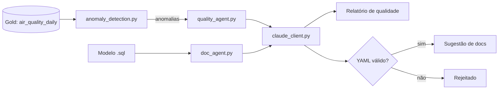

# Pipeline com IA Integrada

Dois agentes de IA aplicados ao pipeline dos Projetos 01/03/04:
1. **Agente de qualidade de dados** — detecta anomalias estatisticamente
   (Python puro, sem IA) e usa o Claude só para explicar os achados em
   linguagem natural, para um público não-técnico.
2. **Agente de documentação** — lê um modelo SQL do dbt e sugere
   descrições de colunas no formato `schema.yml`, para revisão humana.

Projeto 05 de uma série de 6 documentando minha transição de Analista
de Dados para Engenharia/Arquitetura de Dados — veja o [perfil
completo](https://github.com/amanda-martins-data).

## Arquitetura



Decisões de arquitetura e trade-offs documentados em
[`docs/architecture.md`](docs/architecture.md) — incluindo por que a
matemática nunca é delegada ao modelo de linguagem.

## Stack

`Python` · `Claude API (Anthropic SDK)` · `PyYAML` · `pytest`

## Estrutura

```
.
├── src/
│   ├── anomaly_detection.py   # detecção estatística — sem IA, 100% testável
│   ├── claude_client.py       # única camada que fala com a API de verdade
│   ├── quality_agent.py       # orquestra: anomalias -> explicação em texto
│   ├── doc_agent.py           # orquestra: SQL -> sugestão de documentação
│   ├── run_quality_check.py   # CLI do agente de qualidade
│   └── run_doc_generation.py  # CLI do agente de documentação
├── prompts/                   # prompts versionados como arquivos, não strings no código
├── tests/                     # 14 testes, todos offline (FakeClaudeClient)
└── docs/architecture.md
```

## Como rodar

**1. Testar a lógica de negócio (sem API key, sem custo):**
```bash
pip install -r requirements.txt
python -m pytest tests/ -v
```

**2. Rodar de verdade (requer ANTHROPIC_API_KEY):**
```bash
export ANTHROPIC_API_KEY="sua_chave_aqui"

# agente de qualidade — espera um JSON no formato da camada Gold
python src/run_quality_check.py caminho/para/air_quality_daily.json

# agente de documentação — sugere docs para um modelo dbt
python src/run_doc_generation.py caminho/para/modelo.sql
```

## Demonstração (fluxo completo, sem chamar a API real)

Com uma resposta simulada realista, o pipeline completo — detecção →
formatação do prompt → (resposta) — funciona assim:

```
=== PROMPT ENVIADO AO CLAUDE ===
Anomalias detectadas (ordenadas por relevância):

- Cidade: São Paulo | Poluente: pm25 | Data: 2026-01-05
  Valor observado: 78.0 | Média dos dias anteriores: 20.5 (desvio padrão: 1.12)
  Direção: acima do normal | Severidade: alta

=== RELATÓRIO (resposta simulada) ===
🔴 São Paulo — PM2.5 (severidade alta)
O valor de hoje (78.0) ficou muito acima do padrão dos últimos dias
(média de ~20.5). Isso pode indicar um evento real de poluição
(ex.: queimada próxima) ou uma falha temporária no sensor — vale
checar a estação antes de confiar no dado para relatórios oficiais.
```

## Validação

Sem `ANTHROPIC_API_KEY` disponível neste ambiente, a validação seguiu
a mesma estratégia dos projetos anteriores (detalhes em
`docs/architecture.md`): **14/14 testes passando**, cobrindo a
detecção de anomalias (100% determinística) e a orquestração dos dois
agentes via `FakeClaudeClient` — incluindo a rejeição de YAML
malformado no agente de documentação, o caso de teste mais importante
deste projeto.

## Próximos passos do portfólio

- **Projeto 06** — observabilidade: o relatório de qualidade deste
  projeto vira a camada de alerta sobre os testes de dados existentes.
