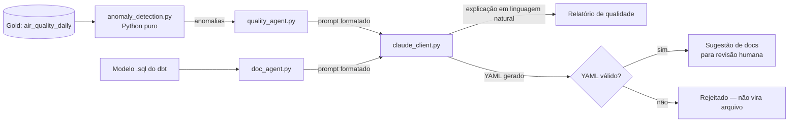

# Arquitetura — Pipeline com IA Integrada

## Visão geral

Dois agentes de IA aplicados ao pipeline dos Projetos 01/03/04:
1. **Agente de qualidade**: explica anomalias estatísticas em linguagem
   natural, para quem não lê SQL.
2. **Agente de documentação**: sugere descrições de colunas para os
   modelos dbt, a partir do próprio SQL.

## Decisões e trade-offs

### 1. Matemática determinística, LLM só para linguagem
`anomaly_detection.py` não importa nada de IA — é `statistics` da
biblioteca padrão. A decisão de "isso é ou não uma anomalia" nunca é
delegada ao modelo de linguagem; o Claude só recebe números já
corretos e os traduz em texto. Isso torna a parte crítica do sistema
(a detecção em si) 100% testável e determinística — sem alucinação
possível ali, porque não há geração ali.

### 2. Client isolado, injeção de dependência nos agentes
`quality_agent.generate_quality_report` e `doc_agent.generate_model_docs`
recebem o client como parâmetro (`ClaudeClientProtocol`), em vez de
instanciar `ClaudeClient` internamente. Nos testes, um
`FakeClaudeClient` substitui a API real — **nenhum teste deste projeto
faz uma chamada de rede**. Isso também significa que trocar de modelo,
adicionar retry ou cache é uma mudança em um único arquivo
(`claude_client.py`), sem tocar na lógica de orquestração.

### 3. Prompts como arquivos, não strings no código
`prompts/*.txt` são arquivos versionados separadamente do código
Python. Ajustar o tom do relatório de qualidade ou as regras do
gerador de documentação é uma mudança de conteúdo, revisável em um PR
como texto — não uma mudança de código que precisa passar por review
de engenharia para um ajuste de redação.

### 4. Documentação gerada por IA nunca é aplicada automaticamente
`doc_agent` **valida** que a resposta é YAML bem formado
(`yaml.safe_load` + checagem de tipo) antes de considerá-la utilizável,
e mesmo assim só a imprime para revisão — não sobrescreve `schema.yml`
sozinho. Documentação errada, aceita sem revisão, é pior do que a
ausência de documentação: ela engana quem confia nela.

### 5. `temperature=0` no client real
Para os dois casos de uso deste projeto (explicar uma anomalia,
documentar um SQL), consistência é mais valiosa do que criatividade.
Rodar o mesmo input duas vezes deve produzir respostas equivalentes.

## Validação

Sem `ANTHROPIC_API_KEY` configurada neste ambiente, a validação seguiu
a mesma estratégia dos Projetos 01-04: tudo que **não** depende da API
real foi testado de verdade.
- `anomaly_detection.py`: 6 testes cobrindo pico, queda, série estável,
  série com histórico insuficiente e série constante (stdev = 0).
- `quality_agent.py` e `doc_agent.py`: 8 testes usando `FakeClaudeClient`,
  cobrindo a formatação do prompt e — o caso mais importante — a
  **rejeição de YAML malformado** vindo do agente de documentação.
- Fluxo completo demonstrado manualmente com uma resposta simulada
  realista (ver README), confirmando que a detecção determinística e a
  formatação do prompt produzem exatamente o texto esperado antes de
  chegar à API.
- **Não testado**: uma chamada real à API da Anthropic (exige
  `ANTHROPIC_API_KEY`, fora do escopo deste ambiente de portfólio).
  `claude_client.py` é propositalmente a única peça não coberta por
  teste automatizado — é também a única peça pequena o bastante para
  revisar visualmente com confiança.

## Limitações conhecidas / próximos passos
- Sem cache de respostas — em produção, evitaria custo repetido para o
  mesmo conjunto de anomalias.
- Sem rate limiting / retry explícito no `claude_client.py`.
- O agente de documentação sugere, mas não abre um PR automaticamente —
  integração com GitHub Actions seria o próximo passo natural,
  aproximando este projeto do **Projeto 06** (observabilidade).
